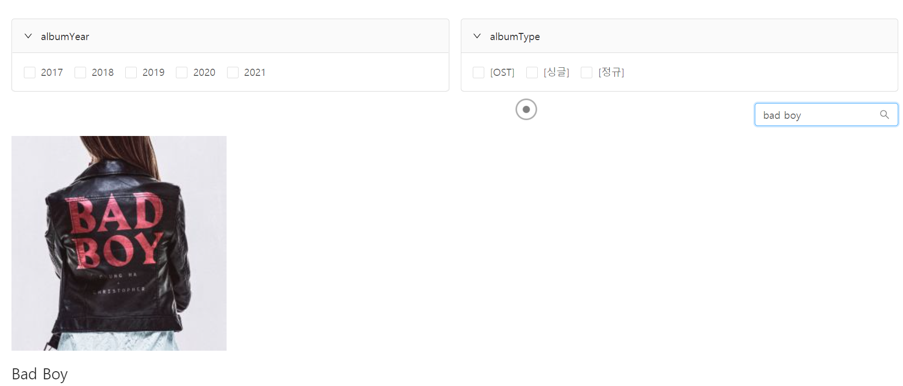

# Product Name
> Singer ChungHa Brocher Site  


## Tech/framework used

1) Front-End
- React
- Typescript
- Styled-Component
- Framer-Motion
2) Back-End
- NodeJS
- MongoDB
3) Web Scrapping
- NodeJS

## Product Introduction 
With all the album,song lists scrpped from 
'Melon' ( www.melon.com ) ,
you can specically see the intro, explanation
of singer Chungha's arts 

## Product Description

<br/>

### 1) MainPage


Displaying All Lists of Albums
with Slide Shows

<br/>
<br/>

### 2) Albums Page


displaying All Lists of Albums 
with Scrolls

<br/>



You can search albums by it's name

<br/>


You can apply filters

<br/>
<br/>

### 3) Single Album Page


displaying single Album

<br/>
<br/>

### 4) Pictures Page


displaying Lists of pictures
randomly

<br/>
<br/>

### 5) Songs Page


displaying songs Lists

<br/>
<br/>

## Development setup

download the application

1) (at the root folder)
```sh
npm install 
```
2) (go to client folder)
```sh
cd client
npm i 
```

3) ( at the root folder )
```sh
npm run dev 

```


## Release History

* 0.0.1
    * Work in progress (React,Typescript,NodeJS,Scrapping)

## Meta

OH BUM JUN  – beomjun0638@hanmail.net

[https://github.com/ohbumjun/React_ChungHaBrocherSite](https://github.com/ohbumjun/React_ChungHaBrocherSite)

